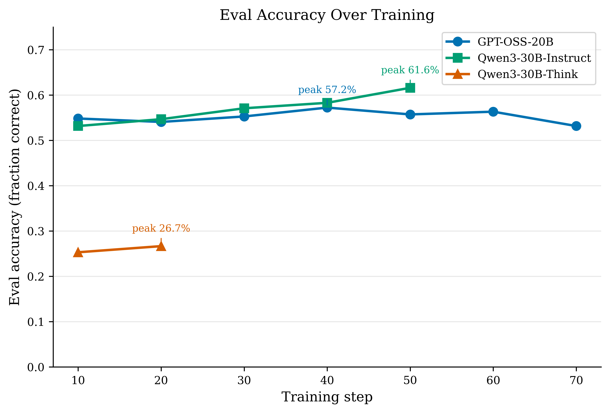
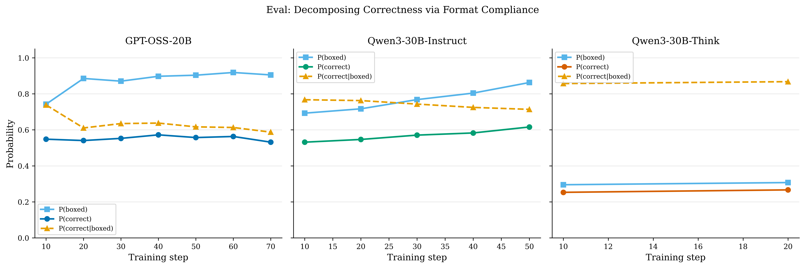
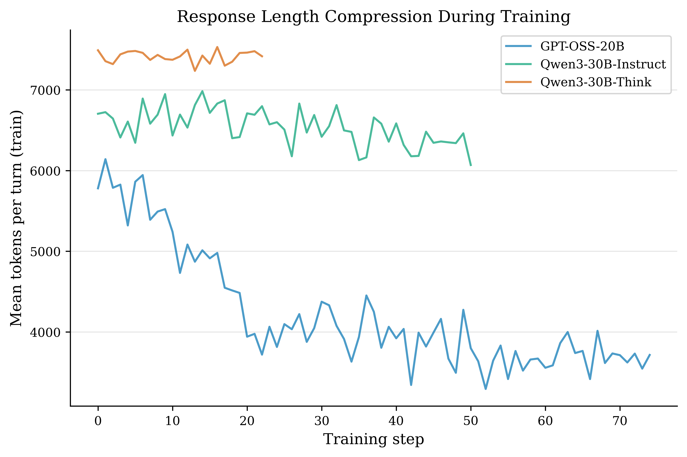
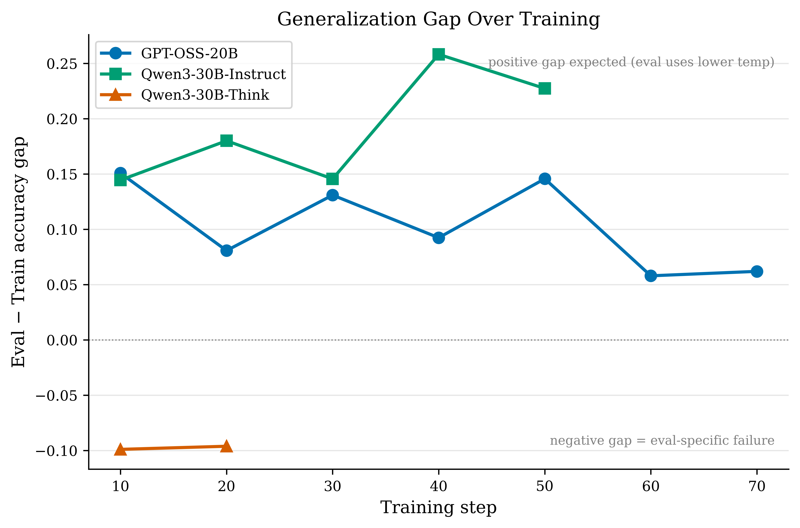
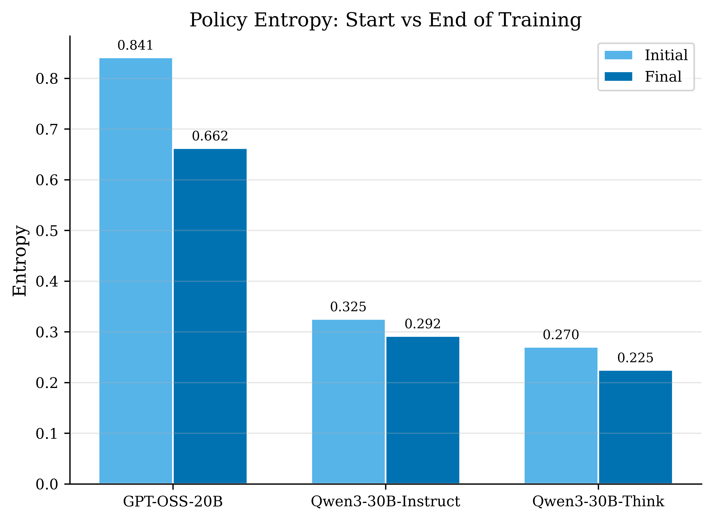
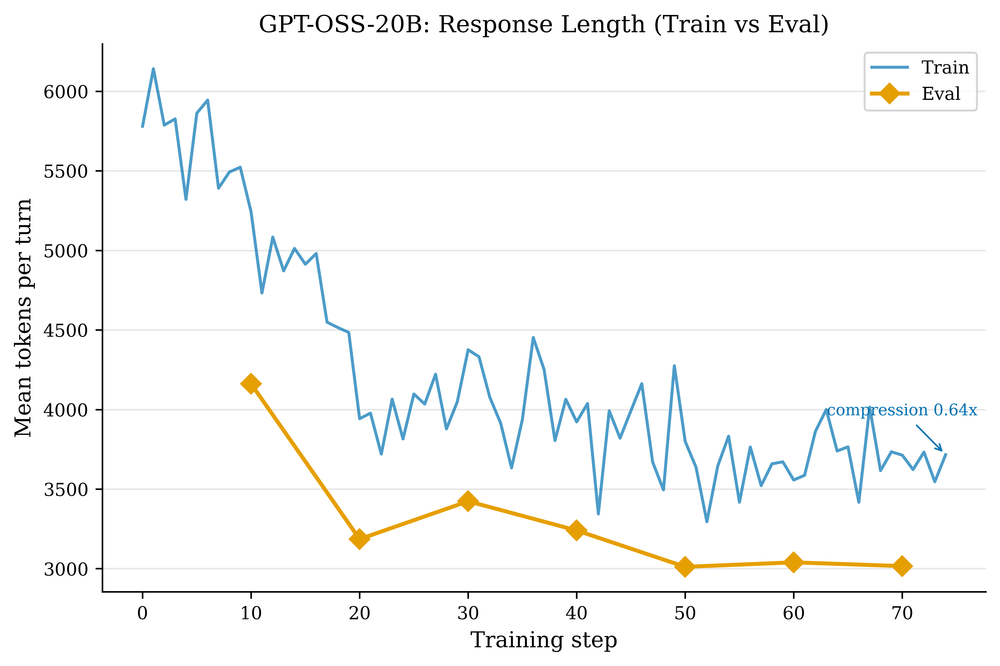
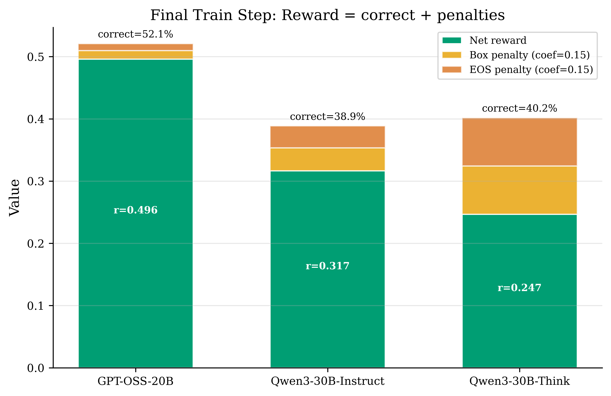
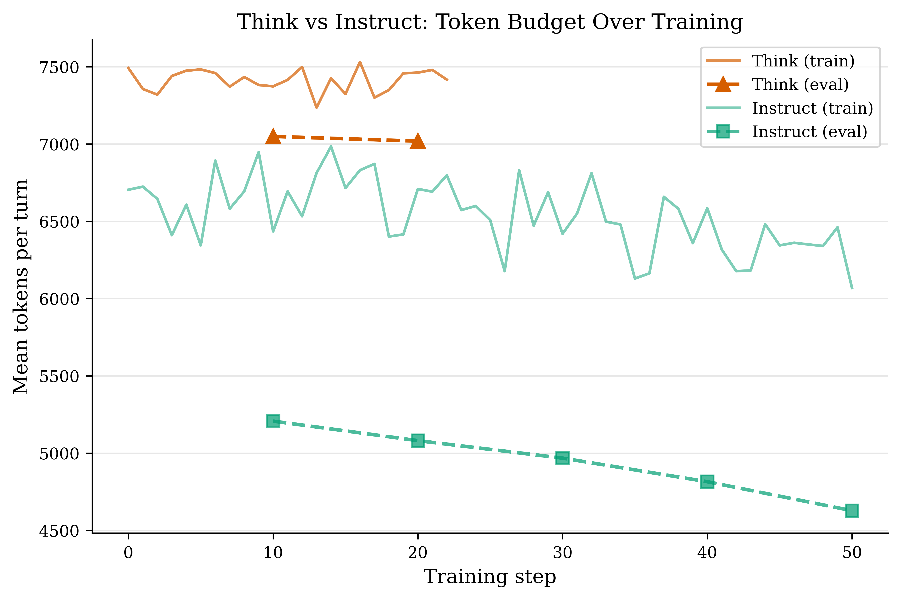
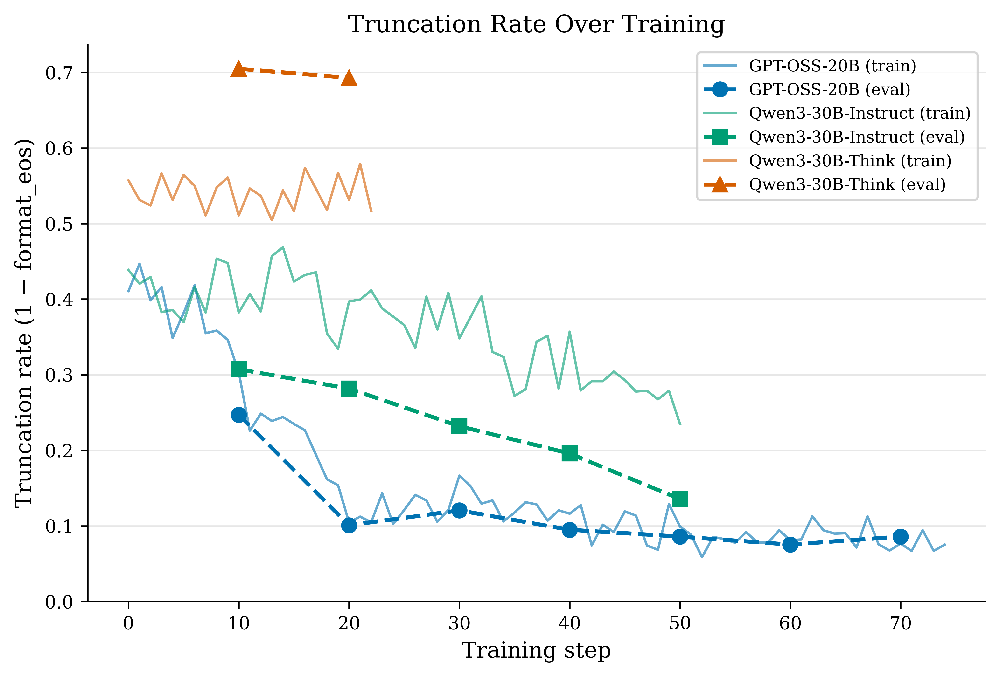
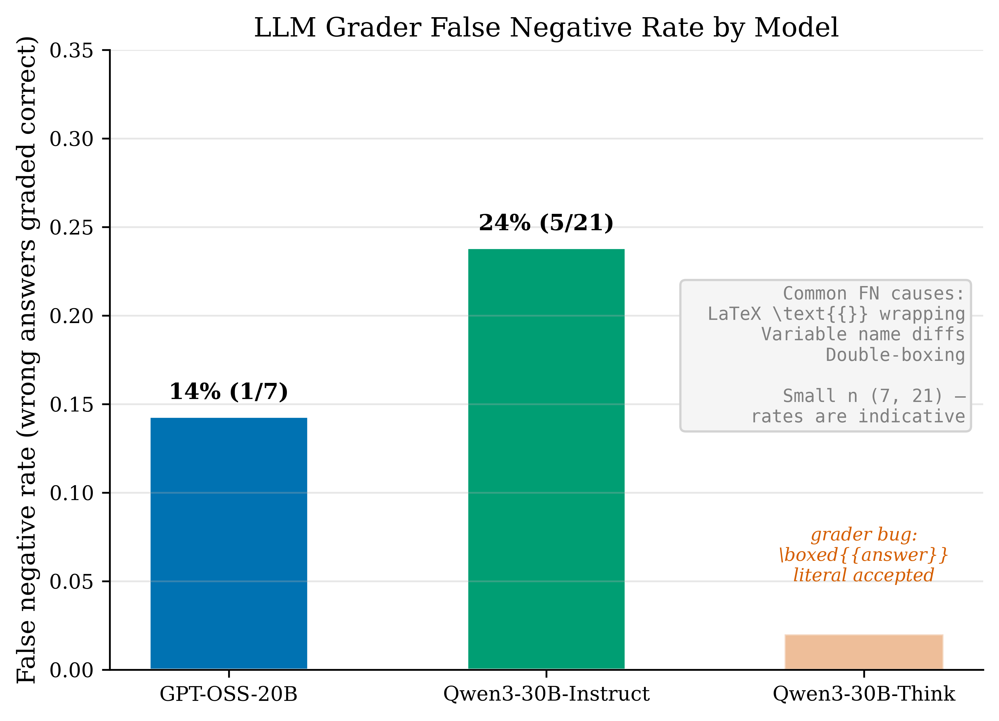

# RLVR on Competition Math: Three Models, One Dataset

**Models:** GPT-OSS-20B, Qwen3-30B-Instruct-2507, Qwen3-30B-Think
**Dataset:** OmniMath-2 (4,428 problems, 85/15 train/eval split)
**Method:** PPO with MaxRL-aligned hyperparameters (LR=1e-5, clip 0.2, KL=0, G=16, B=128)
**Duration:** 75 steps (GPT-OSS), 51 steps (Instruct), 23 steps (Think)

## Executive Summary

I trained three models on OmniMath-2 with identical PPO configs (seed=42, same batch ordering). Same reward, same hyperparameters. The models diverge sharply. Initial policy entropy correlates with how much each model learns, but n=3 and entropy is confounded with model family, so I would not bet much on that variable alone.

GPT-OSS-20B (entropy 0.84 nats, perplexity 2.3) was the only model that compressed. Train correct improved +12.5pp, format compliance +35.5pp, tokens/response dropped 36% (5,780 to 3,716). Eval accuracy peaked at **57.2%** (step 40) then declined, consistent with over-optimization but confounded by composition effects and single-seed variance. The model pruned dead-end reasoning, cut metacognitive overhead. It overshot into guess-and-box behavior by step 17.

Qwen3-30B-Instruct (entropy 0.33 nats, perplexity 1.4) had the best eval progression: **61.6%** at step 50, monotonically increasing with no sign of peaking. Train accuracy was flat (+3.8pp over 50 steps). The improvement is format-driven: truncation dropped from 31% to 14%, amplified by the lower eval temperature (0.6). The SFT template prior persisted unchanged. Plausibly entropy was too low for RL to modify structural patterns, though the headers being reward-neutral is a competing explanation (see Qualitative Analysis).

Qwen3-30B-Think (entropy 0.27 nats, perplexity 1.3) achieved only **26.7%** eval correct despite the highest P(correct|boxed) of any model (0.87). The problem is simple: 70% of eval responses hit the 8,192-token ceiling. The model burns 30-80% of its think block on post-answer rumination. Eval temperature (0.6) worsens this by pushing probability mass toward the longer, always-truncated response mode.

What I found:

1. P(correct) = P(boxed) x P(correct|boxed) cleanly separates format compliance from conditional accuracy. Format is the primary early channel. 86% of GPT-OSS reward improvement came from penalty reduction. Whether RL is teaching "math" at all in these runs is a question worth sitting with.

2. Entropy appears to gate RL learnability. GPT-OSS (3x the entropy) improves train-correct 2.5x faster per step, confounded with architecture and model size. The Qwen models are near-deterministic (top token >70% probability), so G=16 rollouts produce near-identical responses with minimal advantage variance.

3. A composition effect masks math improvement. As P(boxed) rises, newly-completing responses are disproportionately wrong, diluting P(c|b). GPT-OSS's P(c|b) declined 15.1pp even as format improved 17.6pp. Counterfactual upper envelope: best format (91.9%) x best P(c|b) (73.8%) = **67.8%**, 10.6pp above actual peak (assumes independence; true headroom is lower since the axes are coupled).

4. The composite grader (SymPy + LLM) fixes 8.7% of false negatives with zero false positives. Instruct's 24% grader FN rate (n=21, CI [11%, 45%]) actively punishes correct-but-unusually-formatted answers.



## Table of Contents

1. [Experimental Setup and Hyperparameters](#experimental-setup-and-hyperparameters)
2. [Infrastructure and Throughput](#infrastructure-and-throughput)
3. [Reproducing the v3b Runs](#reproducing-the-v3b-runs)
4. [Quantitative Results](#quantitative-results)
5. [Entropy Bottleneck](#entropy-bottleneck-why-gpt-oss-learns-and-qwen-doesnt)
6. [Compression Analysis: GPT-OSS](#compression-analysis-gpt-oss-analysis-channel-evolution)
7. [Think Model Analysis](#qwen3-think-model-token-budget-and-eval-temperature)
8. [Qualitative Analysis](#qualitative-analysis-reasoning-quality-and-failure-modes)
9. [Grader Analysis](#grader-analysis-false-negatives-and-the-composite-grader)
10. [Conclusions and Future Work](#conclusions-and-future-work)
11. [References](#references)

# Experimental Setup and Hyperparameters

## Model Matrix

I ran three model families on OmniMath-2 (4,428 problems, 85/15 train/eval split):

| Model | Size | Renderer | Thinking mode |
|-------|------|----------|---------------|
| GPT-OSS-20B | 20B | `gpt_oss_medium_reasoning` | Harmony analysis channel |
| Qwen3-30B-A3B-Instruct-2507 | 30B (3B active) | `qwen3_instruct` | Never thinks |
| Qwen3-30B-A3B | 30B (3B active) | `qwen3` | Visible `<think>` blocks |

I also tried Qwen3-30B-A3B with `qwen3_disable_thinking` but dropped it in v1. The renderer prepends `<think>\n\n</think>` as a suppression hint. The base model ignores it and thinks anyway.

## Configuration Evolution

### v1 (killed after ~10 batches)

| Parameter | Value | Problem |
|-----------|-------|---------|
| LR | 5e-4 (auto via `get_lr`) | 50x too high for RL |
| Loss | `importance_sampling` | No ratio clipping |
| KL coef | 0.0 | No stabilization |
| Grad clip | 0.0 | Unbounded updates |
| Batch size | 16 | High variance |
| Group size | 4 | Insufficient for MaxRL advantages |
| `num_substeps` | 2 | Accelerated drift on stale data |
| `remove_constant_groups` | True | Selection bias toward lucky groups |

GPT-OSS collapsed within 19 batches. Responses devolved into repeating "medium medium medium," the word from the system prompt becoming a degenerate attractor. KL spiked from 0.008 to 0.074. I killed the run.

### v2 (ran ~30-40 batches per model)

| Change | From | To | Rationale |
|--------|------|----|-----------|
| KL coef | 0.0 | 0.03 | Prevent v1-style collapse |
| Group size | 4 | 8 | More diverse rollouts per prompt |
| Eval fraction | 0.15 (664) | 0.025 (~110) | Eval was taking 2-3h at 8k max_tokens |
| Log path | auto | explicit per run | Prevent collisions on same model_name |

KL penalty at 0.03 produced ~0.0005 effective penalty against rewards of 0.2-0.4. That is functionally zero. It prevented catastrophic collapse but placed no real constraint on the policy.

### v3b (production runs)

| Parameter | Value | Source |
|-----------|-------|--------|
| LR | 1e-5 | MaxRL 1e-6 full-param, scaled 10x for LoRA |
| Loss | PPO | Clip ratio [0.8, 1.2] (symmetric) |
| KL coef | 0.0 | MaxRL: `use_kl_loss=False` |
| Grad clip | 0.3 | MaxRL verbatim |
| Batch size (B) | 128 | MaxRL uses 256; my GPU budget covers 128 |
| Group size (G) | 16 | MaxRL verbatim |
| Advantage | MaxRL | Per-group with alpha=0.5 subgroups |
| LoRA rank | 32 | Standard for 20-30B models |
| Max tokens | 8,192 | 2x MaxRL's 4,096 for thinking models |
| Train temperature | 1.0 | MaxRL verbatim |
| Eval temperature | 0.6 | MaxRL `val_kwargs.temperature=0.6` |
| Eval top_p | 0.95 | MaxRL `val_kwargs.top_p=0.95` (was not wired in prior runs; now plumbed through) |
| Format coef | 0.15 | Per-reward penalty for missing `\boxed{}` |
| EOS coef | 0.15 | Per-reward penalty for truncation |
| Seed | 42 | Deterministic dataset split and batch ordering |
| Grader | LLM (gpt-5-mini) | `reasoning_effort=medium`, math-aware prompt |
| Episodes/step | 2,048 | B=128 x G=16 |

## Reward Function

```
reward = correct + format_coef * (boxed - 1) + eos_coef * (eos - 1)
```

`correct` in {0, 1} (LLM grader verdict), `boxed` in {0, 1} (contains `\boxed{}`), `eos` in {0, 1} (1 if the model emitted a stop token; 0 if truncated at max_tokens). Truncated responses receive `correct=0` regardless of content. Reward range: [-0.30, 1.00].

## LoRA Learning Rate Derivation

MaxRL uses LR=1e-6 for full-parameter training. The 10x rule from "LoRA Without Regret" (Thinking Machines Lab) says LoRA gradients project into a rank-r subspace, concentrating gradient energy into fewer parameters. Effective per-parameter LR is ~10x lower, so LoRA needs 10x higher LR. 1e-6 x 10 = **1e-5**.

## Comparison with Published Methods

| Parameter | Ours (v3b) | MaxRL | DAPO | DeepSeek-R1 |
|-----------|-----------|-------|------|-------------|
| Batch size (prompts) | 128 | 256 | 512 | 32 |
| Group size | 16 | 16 | 16 | 16 |
| LR | 1e-5 (LoRA) | 1e-6 (full) | — | 3e-6 |
| KL | 0.0 | 0.0 | 0.0 | 0.001 |
| Clip ratio | 0.2/0.2 | 0.2/0.2 | 0.2/0.28 | 10.0 |
| Grad clip | 0.3 | 0.3 | — | — |
| Max response tokens | 8,192 | 4,096 | — | 32,768 |
| Advantage | MaxRL | MaxRL | GRPO variant | GRPO |
| Params trained | LoRA rank-32 | Full | Full | Full |

# Infrastructure and Throughput

## Cost Split

Sampling eats 97% of wall time. Training is 3%. So if you want to go faster, reduce sampling latency. Training-side optimizations are irrelevant.

| Model | Wall time/step | Avg tokens/response | Effective rate |
|-------|---------------|---------------------|----------------|
| GPT-OSS | 15-20 min | 4.5-5.5k | ~3-4 steps/hr |
| Qwen3 Instruct | 20-25 min | 6.5-6.8k | ~2-3 steps/hr |
| Qwen3 Think | 30-35 min | 7.3-7.5k | ~2 steps/hr |

## Batched Rollout

Setting `num_samples=G` on sampling requests shares the KV-cache prefix across all G completions for single-turn envs. That got me a 1.5x throughput improvement over G separate requests.

## Streaming Minibatches

`StreamMinibatchConfig` overlaps sampling with training: while one minibatch trains, the next rollouts are already in flight. At B=128 where training is ~3% of wall time, the overlap saves ~1-2 minutes per step. It matters more at larger batch sizes.

## Substeps

`num_substeps=K` takes K gradient steps on the same rollout data before re-sampling. Each additional substep costs nearly zero wall clock (training is 3%). v3b uses K=1. v2 tried K=2 but it accelerated policy drift because the second step trains on off-policy data.

## Connection Throttling

`sampling_max_connections = max(16, batch_size * group_size)` controls HTTP parallelism. The default 16 connections throttled throughput 8x for B=128, G=16 (2,048 concurrent requests through 16 connections). I only found this after v2. v3b uses the full connection count.

# Reproducing the v3b Runs

All three runs use the RLVR CLI (`tinker_cookbook/recipes/rlvr/train.py`). CLI defaults match v3b values (loss=PPO, grad_clip=0.3, format_coef=0.15, eos_coef=0.15).

**GPT-OSS-20B:**
```bash
uv run python -m tinker_cookbook.recipes.rlvr.train \
  --model_name openai/gpt-oss-20b \
  --dataset omni_math \
  --batch_size 128 \
  --group_size 16 \
  --max_tokens 8192 \
  --learning_rate 1e-5 \
  --wandb_project rlvr-omnimath
```

**Qwen3-30B-Instruct:**
```bash
uv run python -m tinker_cookbook.recipes.rlvr.train \
  --model_name Qwen/Qwen3-30B-A3B-Instruct-2507 \
  --dataset omni_math \
  --batch_size 128 \
  --group_size 16 \
  --max_tokens 8192 \
  --learning_rate 1e-5 \
  --wandb_project rlvr-omnimath
```

**Qwen3-30B-Think:**
```bash
uv run python -m tinker_cookbook.recipes.rlvr.train \
  --model_name Qwen/Qwen3-30B-A3B \
  --dataset omni_math \
  --batch_size 128 \
  --group_size 16 \
  --max_tokens 8192 \
  --learning_rate 1e-5 \
  --wandb_project rlvr-omnimath
```

Defaults that changed from v2 to v3b: `loss_fn` (importance_sampling to ppo), `grad_clip_norm` (0.0 to 0.3), `format_coef` (0.1 to 0.15), `eos_coef` (0.0 to 0.15). For DAPO-style asymmetric clipping (0.2/0.28), pass `--clip_ratio_upper 0.28`.

Data: `reports/data/all_metrics.json` contains all training/eval metrics (163 rows, 3 runs). Figures are reproducible via `scripts/gen_research_figures.py`.

# Quantitative Results

## Eval Accuracy Over Training

I evaluated every 10 steps on 664 held-out OmniMath problems at temperature 0.6. Prior runs used top_p=1.0 (SDK default) because it wasn't wired through the CLI. Now plumbed as eval_top_p=0.95.

### GPT-OSS-20B (75 train steps, 7 eval points)

| Step | P(correct) | P(boxed) | P(c\|b) | Tok/turn | Trunc% | Reward |
|------|-----------|---------|--------|---------|--------|--------|
| 10 | 0.5482 | 0.7425 | 0.7383 | 4161 | 24.7% | 0.4725 |
| 20 | 0.5407 | 0.8855 | 0.6105 | 3185 | 10.1% | 0.5084 |
| 30 | 0.5527 | 0.8705 | 0.6349 | 3423 | 12.1% | 0.5152 |
| 40 | **0.5723** | 0.8976 | 0.6376 | 3240 | 9.5% | **0.5427** |
| 50 | 0.5572 | 0.9036 | 0.6167 | 3011 | 8.6% | 0.5299 |
| 60 | 0.5633 | **0.9187** | 0.6131 | 3039 | 7.5% | 0.5398 |
| 70 | 0.5316 | 0.9051 | 0.5874 | 3016 | 8.6% | 0.5045 |

Best eval: **57.23%** at step 40. Accuracy declined after step 40 despite continued format improvement.



### Qwen3-30B-Instruct (51 train steps, 5 eval points)

| Step | P(correct) | P(boxed) | P(c\|b) | Tok/turn | Trunc% | Reward |
|------|-----------|---------|--------|---------|--------|--------|
| 10 | 0.5316 | 0.6928 | 0.7674 | 5207 | 30.7% | 0.4395 |
| 20 | 0.5467 | 0.7169 | 0.7626 | 5081 | 28.2% | 0.4620 |
| 30 | 0.5708 | 0.7681 | 0.7431 | 4968 | 23.2% | 0.5012 |
| 40 | 0.5828 | 0.8042 | 0.7247 | 4815 | 19.6% | 0.5241 |
| 50 | **0.6160** | **0.8630** | 0.7138 | 4628 | 13.6% | **0.5751** |

Monotonic improvement. Best eval: **61.60%** at step 50, still rising.

### Qwen3-30B-Think (23 train steps, 2 eval points)

| Step | P(correct) | P(boxed) | P(c\|b) | Tok/turn | Trunc% | Reward |
|------|-----------|---------|--------|---------|--------|--------|
| 10 | 0.2530 | 0.2952 | 0.8571 | 7049 | 70.5% | 0.0416 |
| 20 | 0.2666 | 0.3072 | 0.8676 | 7019 | 69.3% | 0.0587 |

Highest P(c|b) of any model (0.87), but 70% truncation rate makes it the worst performer.

## P(correct) Decomposition

### GPT-OSS: Format up, P(c|b) down, net flat

Format improved +17.6pp (0.7425 to 0.9187). P(c|b) declined -15.1pp (0.7383 to 0.5874). These nearly cancel: +1.5pp net at step 60.

Counterfactual upper envelope: step-60 P(boxed) 0.9187 x step-10 P(c|b) 0.7383 = **0.6783**, +10.6pp above actual best. This assumes independence. True headroom is lower since improving format changes which problems contribute to P(c|b).

### Instruct: Format dominates, mild P(c|b) decline

P(boxed) improved +17.0pp while P(c|b) declined only -5.4pp, yielding +8.4pp net. Instruct picks up correct answers from reduced truncation, including genuinely rescued problems (marginal P(c|b) of 0.33-0.63).

Counterfactual upper envelope: 0.8630 x 0.7674 = **0.6622**, +4.6pp headroom (same independence caveat).

### Composition Effect

As P(boxed) rises, previously-truncated responses complete. These come from harder problems (the ones that caused truncation in the first place), so their accuracy conditional on completion is lower. This is a composition/selection effect. It is not Simpson's paradox, which requires trend reversal when you condition on a subgroup variable.

GPT-OSS marginal analysis (step 10 to 20): +95 newly-boxed responses, -5 correct answers total. The negative delta means some previously-correct items were lost. Dilution alone doesn't explain the P(c|b) decline.

Instruct marginal analysis: marginal P(c|b) of newly-boxed responses is 0.33-0.63, below the incumbent 0.77 but positive. That is why Instruct's P(correct) improves while GPT-OSS's is flat.

I saw the same composition effect in v2. GPT-OSS v2 at step 40 had P(c|b) = 76.3% with step-20 format rate 92.9%, yielding counterfactual P(correct) = 0.929 x 0.763 = **70.9%**. The model genuinely learned +10pp of math, but format collapse between steps 20-40 masked it. Format and accuracy interact multiplicatively. A temporary format regression can hide real capability gains.



## Train vs. Eval Gap

I trained at temp=1.0, evaluated at temp=0.6. Eval outperforms train for GPT-OSS and Instruct because lower temperature concentrates sampling around the mode, which is correct more often than not. The Instruct gap widens over training (14pp to 23pp). My best guess is that lower temperature amplifies format gains by favoring the now-more-concise modal response.

The think model goes the other way: train outperforms eval by ~10pp. Lower eval temperature pushes its bimodal distribution toward the truncation peak. I come back to this in the Think Model section.



## Aggregate Training Metrics

| Model | Init entropy | Correct/step | Boxed/step | Tok/step |
|-------|-------------|-------------|-----------|---------|
| GPT-OSS | 0.8413 | +0.00118 | +0.00411 | -27.3 |
| Instruct | 0.3254 | +0.00048 | +0.00328 | -8.4 |
| Think | 0.2701 | -0.00021 | +0.00007 | -0.2 |

GPT-OSS is the only model with real token compression (-36% over 75 steps). All models maintain KL < 0.002 throughout, consistent with MaxRL's design: PPO clipping + low LR, no explicit KL penalty. But GPT-OSS's eval degradation after step 40 shows that low KL alone does not prevent over-optimization. Something else is needed.

# Entropy Bottleneck: Why GPT-OSS Learns and Qwen Doesn't

## The Gap

Same problems, same order (seed=42), same PPO config, same reward. Different outcomes.

| Model | Entropy (nats) | Perplexity | After 20 steps |
|-------|---------------|------------|----------------|
| GPT-OSS-20B | 0.84 | 2.32 | correct +6.4pp, boxed +30.5pp, tok -1838 |
| Qwen3 Instruct | 0.33 | 1.38 | correct +1.6pp, boxed +3.4pp, tok +5 |
| Qwen3 Think | 0.27 | 1.31 | correct -0.1pp, boxed +2.6pp, tok -29 |

GPT-OSS has 2.6-3.1x more entropy than Qwen. In 20 steps it achieves 4x more correct-accuracy improvement and 9-12x more format improvement. The correlation is strong. The causal story is plausible. I still want more data points before I call this settled.



## Why Low Entropy Kills RL Learning

Policy gradient needs advantage variance across rollouts, which needs stochasticity. At perplexity 1.3, the top token has >70% probability. PPO clipping correctly prevents the large parameter updates that would be needed to move mass between tokens. The policy is effectively frozen.

With G=16, a near-deterministic policy produces 16 near-identical responses. The advantage estimator sees no variation. The gradient signal is near zero.

## The Paradox: Instruct Wins on Eval

Despite the entropy bottleneck, Instruct reaches 61.6% vs GPT-OSS's 57.2%. High entropy enables rapid policy modification but also enables overfitting. GPT-OSS eval peaks at step 40 then drops 4.1pp. Instruct, constrained by low entropy, changes slowly and sidesteps over-optimization. The SFT template prior functions as implicit regularization.

I should be honest about what I do not know here. The hyperparameters might suit Instruct better. Model-family differences beyond entropy could be the real driver. This is one seed.

## Entropy Budget

| Model | Entropy (start) | Entropy (end) | Consumed | % of initial |
|-------|----------------|--------------|----------|-------------|
| GPT-OSS | 0.8413 | 0.6621 | 0.1792 | 21.3% |
| Instruct | 0.3254 | 0.2917 | 0.0338 | 10.4% |
| Think | 0.2701 | 0.2248 | 0.0453 | 16.8% |

GPT-OSS consumed 5.3x more entropy than Instruct. Probability mass concentrated onto successful token sequences.

# Compression Analysis: GPT-OSS Analysis Channel Evolution

## The Compression Story

GPT-OSS is the only model that compresses. Over 75 steps, tokens/response dropped 36%:

| Step | Tokens/response | Boxed | Entropy |
|------|----------------|-------|---------|
| 0 | 5,780 | 55.4% | 0.841 |
| 20 | 3,942 | 85.9% | 0.763 |
| 40 | 3,922 | 85.7% | 0.707 |
| 60 | 3,557 | 89.0% | 0.717 |
| 74 | 3,716 | 90.9% | 0.662 |

89% of the compression happens in the first 20 steps, largely from format compliance. Fewer truncations account for 60%.

## Mechanism: Dead-End Pruning

From reasoning quality probes, I decomposed the compression:

| Mechanism | Contribution |
|-----------|-------------|
| Format compliance (fewer truncations) | 60% |
| Reduced metacognitive overhead ("But/Wait/Actually" spirals) | 25% |
| Genuine reasoning efficiency (faster commitment) | 15% |

Self-correction markers dropped 35% in count and 20% in density over 15 steps. The model prunes dead-end exploration and throat-clearing. The concurrent P(c|b) decline (-15.1pp) is the uncomfortable part: some useful reasoning is probably being lost alongside the noise. How much? I cannot say precisely.



## Analysis Channel Death Mode

Sometimes the model enters Harmony's analysis channel and never transitions to final, producing raw tokens without `\boxed{}`. Every such response scores 0%. Death mode rate declined from ~31% to ~19% over training. Multiple v2-to-v3b changes (loss function, LR, group size) may contribute. I can't isolate the PPO clipping effect.

## Reward Decomposition

| Source | Delta | % of total |
|--------|-------|-----------|
| Penalty reduction (format + EOS) | +0.078 | 86% |
| More correct answers | +0.013 | 14% |

The model learned to avoid penalties first. Math improvement is secondary. Whether 86/14 is a problem depends on your priors about what RLVR should be doing.



## Structural Advantage of Harmony Format

The analysis/final channel split gives GPT-OSS a clean "stop thinking, start answering" signal. Qwen's `<think>...</think>` requires learning when to emit `</think>`, which is a harder metacognitive judgment. Both the structural channel split and the 3x entropy gap likely contribute to GPT-OSS's faster compression. These are confounded with architecture and pretraining differences.

# Qwen3 Think Model: Token Budget and Eval Temperature

## Bimodal Response Structure

There are two nearly perfectly separable response types. Structured think blocks (JSON API format) are 98% correct, ~4,800 tokens. Raw `<think>` text (string format) is 0% correct, always 8,192 tokens (truncated).

With G=16, all rollouts on the same problem land in the same mode. Groups are all-correct or all-wrong. Within-group advantage variance is zero. No gradient signal.



## Post-Answer Waste

The model finds answers at reasonable rates but wastes the token budget. Example: it finds the parabola minimum at 19% of the think block (3,284 chars), then spends 13,828 chars (81%) on verification loops. 12 truncated responses had the correct answer inside the think block but ran out of tokens before emitting it. Some post-answer verification could be productive (the first `\boxed{}` might be a candidate rather than the final answer), but 30-80% of the block is far more than any plausible benefit justifies.

## Eval Temperature Disaster

At T=0.6, temperature sharpening concentrates mass on whichever mode has higher base probability. For Think, the raw-think mode (always truncated) is more probable. So lower temperature worsens truncation. Train truncation is ~56%, eval truncation is ~70%. The 10-14pp train-vs-eval gap comes from temperature-induced mode collapse. Generalization is fine.

## Wrong-Boxed Increase: Subreward Hacking

Wrong-boxed responses tripled (2 to 9 per 32 logged). The model learned to emit `\boxed{}` more often, collecting the format subreward (from -0.15 to 0.00), without improving math. Responses shifted from "truncated, no answer" (reward = -0.30) to "completed, wrong answer" (reward = 0.00). The subreward structure incentivizes precisely this.

# Qualitative Analysis: Reasoning Quality and Failure Modes

## GPT-OSS: Compression Arc

Self-correction markers ("But wait", "Actually") declined from 4.8/episode (step 0) to 0.0/episode (step 19). The compression looks genuine: step-0 responses average 18,599 chars with metacognitive spiraling, step-15 averages 2,603 chars with clean reasoning. I can't fully separate dead-end pruning from surface-marker suppression. The model maintained accuracy through step 15, which weakly favors genuine pruning. Then steps 16-17 collapse into guess-and-box: the model can also compress by abandoning reasoning entirely.

At step 0, a single response contains 27 self-correction markers across 32,542 chars. The model explores dead-end branches, backs up, re-explores in rapid succession. By step 15, the same model commits to the correct approach in 351 chars with 0 markers. At steps 16-17 it overshoots into guess-and-box: average response length drops to 198-285 chars, boxed rate stays 100%, correct rate drops to 0%. ("Need final formula: m? The final answer: \boxed{m}.")

## Instruct: Template Lock

The SFT template (`### Step N:` headers) persists unchanged. Template usage increases from 56% to 100%. RL gets boxed-formatting up (75% to 100%) but can't alter the reasoning template at entropy 0.33 nats. Low entropy is one plausible factor. The headers might also just be reward-neutral: they neither help nor hurt correctness, so there is no gradient to remove them. Short-horizon RL may be unable to modify multi-token structural patterns regardless of entropy.

## Think: Post-Solution Tail Bloat

The model finds answers at reasonable rates but wastes the token budget. Example: parabola minimum found at 19% of the think block (3,284 chars), followed by 13,828 chars (81%) of verification loops. 12 truncated responses had the correct answer inside the think block but ran out of tokens before emitting it.

## Truncation Taxonomy (187 total truncated episodes)

| Mode | GPT-OSS | Instruct | Think |
|------|--------:|---------:|------:|
| Analysis channel death | 66 | — | — |
| Dead-end spiral | 1 | 9 | 88 |
| Productive truncation | 2 | 4 | 12 |
| Degenerate repetition | 5 | 0 | 0 |



# Grader Analysis: False Negatives and the Composite Grader

## False Negative Rates

Manual review:

| Model | FN rate | Primary failure modes |
|-------|---------|----------------------|
| GPT-OSS | 14% (1/7) | Symbolic notation vs English |
| Instruct | **24%** (5/21) | LaTeX wrappers, variable names, double-boxing |
| Think | bug found | `\boxed{answer}` literal accepted |

Small samples (n=7 and n=21), wide CIs: [3%, 53%] and [11%, 45%]. The direction (Instruct worse) holds. Point estimates are noisy.

Instruct's 24% FN rate is a toxic training signal. The model learned to avoid correct-but-awkward formats: grader FNs dropped from 4/32 to 1/32 over 15 steps. Genuinely wrong answers increased from 2/32 to 4/32. After correcting for grader FNs, accuracy on the logged batches actually declined slightly over that 15-step window. The grader is the culprit here.

## Composite Grader

Two-stage: SymPy first (deterministic, <1ms) for symbolic equivalence, LLM fallback for everything else.

Stress test on 310 response pairs from v3b training logs:

| Metric | Count |
|--------|-------|
| FN fixed (INCORRECT -> CORRECT) | **27** (8.7%) |
| FP introduced (CORRECT -> INCORRECT) | **0** |

Zero false positives is what matters. On 310 samples, the composite grader strictly dominates the LLM-only grader.



# Conclusions and Future Work

## What I Found

Learning happens in three stages, ordered by difficulty.

Format compliance comes first. All models learn `\boxed{}`. It is the easiest behavioral change: a single token directly selected by reward. 86% of GPT-OSS's early reward improvement came from penalty reduction.

Response compression comes second (GPT-OSS only). The model prunes dead-end reasoning and metacognitive overhead. This requires sufficient entropy: GPT-OSS at 0.84 nats compresses, both Qwen models below 0.33 nats do not. The threshold is somewhere in (0.33, 0.84). Tokens/response dropped 36% over 75 steps.

Math improvement comes third, if at all. Train correct improved +12.5pp for GPT-OSS, but this partially reflects format improvement (more completions = more chances to be correct). P(c|b) declined for both GPT-OSS and Instruct. They solve the same problems more reliably rather than solving harder ones. I am not confident these runs taught any new math.

## Constraints

The entropy bottleneck is the big one. Policy entropy well above 0.33 nats appears necessary for RLVR learning at LR=1e-5. The exact threshold is somewhere in (0.33, 0.84). The token budget is a hard wall too: Think's 70% truncation at 8,192 tokens can't be fixed by RL, and 40% of those truncated responses had the correct answer sitting right there.

Grader accuracy matters more than I expected. A 24% FN rate on Instruct creates reward misalignment where the model optimizes grader-legibility over correctness. And over-optimization is real: GPT-OSS eval peaked at step 40 then declined 4.1pp by step 70. High-entropy models need early stopping or KL regularization.

## What I'd Do Next

The easiest win is switching to the composite grader for all future runs. Zero FP on 310 samples (95% CI [0%, 1.2%]), 8.7% FN improvement. Risk is SymPy parsing edge cases on OOD formats. For the think model specifically, I'd increase max_tokens to 16,384 (rescues ~22% of responses that have the correct answer but run out of tokens, at ~2x wall time) and eval at T=1.0 instead of 0.6, since MaxRL's eval temperature is calibrated for non-thinking models and the bimodal distribution needs a temperature that doesn't push everything into the truncation mode.

For the low-entropy Qwen models, I'd try higher training temperature (1.2-1.5) combined with higher LR (2-3e-5) to broaden exploration and unfreeze learning. A single concise math solution as a few-shot exemplar in Instruct's system prompt could break the template prior more effectively than 100 RL steps.

Two infrastructure-level changes: difficulty-adaptive sampling (uniform sampling wastes compute on problems that are all-correct or all-wrong within every group, so targeting the decision boundary increases gradient signal per episode) and bumping eos_coef from 0.15 toward 0.3, since the current truncation penalty may not be competitive with the correct-answer reward.

# References

1. **MaxRL** — Tajwar et al. "Scaling LLM Test-Time Compute with Reinforcement Learning." GitHub: `tajwarfahim/maxrl`. Config: LR=1e-6, PPO clip 0.2, KL=0, G=16, B=256, grad_clip=0.3.

2. **DAPO** — ByteDance. "DAPO: Direct Advantage Policy Optimization." arXiv:2503.14476. Config: asymmetric clip (0.2/0.28), KL=0, B=512, dynamic sampling.

3. **DeepSeek-R1** — DeepSeek. "DeepSeek-R1: Incentivizing Reasoning Capability in LLMs via Reinforcement Learning." arXiv:2501.12948. Config: KL=0.001, clip=10, G=16, max_length=32768.

4. **LoRA Without Regret** — Thinking Machines Lab. The 10x LR rule for LoRA: effective per-parameter learning rate is ~10x lower than headline LR due to rank-r projection.

*Data source: `reports/data/all_metrics.json` (163 rows, 3 runs). Extraction script: `reports/data/extract_metrics.py`. All figures in `reports/figures/`.*
