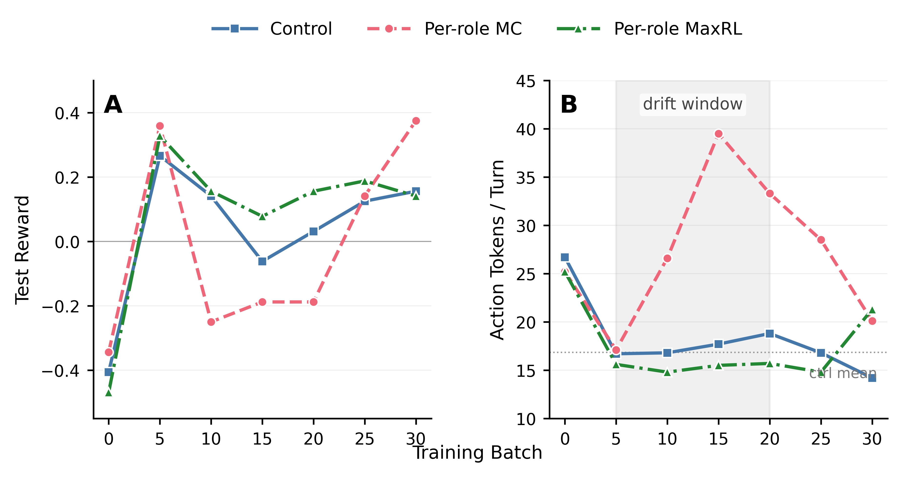

# Gradient Cancellation in Zero-Sum Self-Play with Per-Token Sum Loss

Research note from a TicTacToe self-play ablation (2026-03-10).

W&B project: `jvelja-private/tictactoe-subgroup-ablation`

## Setup

Three arms, identical except advantage computation. All use `importance_sampling` loss (no PPO clipping), group size = 8 games (16 rollouts per group, 8 per role subgroup), Qwen3-4B on TicTacToe-v0.

| Arm | Subgroups | Scheme | W&B run |
|-----|-----------|--------|---------|
| Control | None (full group) | mean_center | `uexsljv6` |
| Treatment A | Per-role | mean_center | `6nsc797v` |
| Treatment B | Per-role | maxrl | `lb6v1bsm` |

## Results



**Figure 1.** Test reward (A) and action tokens per turn (B) across 30 training batches. Per-role MC (dashed pink) enters a verbosity drift window in batches 5–20: action length doubles to ~2× the control mean while test reward collapses from +0.36 to −0.19. Control and Per-role MaxRL converge monotonically. MC recovers by batch 30 to the highest test reward (+0.375), suggesting the drift slows convergence rather than breaking it. Single seed per arm; entropy collapsed uniformly across all three (not shown).

### Test reward vs frozen opponent

| Batch | Control | Treatment MC | Treatment MaxRL |
|-------|---------|-------------|-----------------|
| 0 | -0.406 | -0.344 | -0.469 |
| 5 | **+0.266** | **+0.359** | **+0.328** |
| 10 | +0.141 | -0.250 | +0.156 |
| 15 | -0.062 | -0.188 | +0.078 |
| 20 | +0.031 | -0.188 | +0.156 |
| 25 | +0.125 | +0.141 | +0.188 |
| 30 | +0.156 | **+0.375** | +0.141 |

### Action tokens per turn (train)

| Batch | Control | Treatment MC | Treatment MaxRL |
|-------|---------|-------------|-----------------|
| 0 | 26.7 | 25.2 | 25.2 |
| 5 | 16.7 | 17.1 | **15.6** |
| 10 | 16.8 | 26.6 | 14.8 |
| 15 | 17.7 | **39.5** | 15.5 |
| 20 | 18.8 | 33.3 | 15.7 |
| 25 | 16.8 | 28.5 | 14.8 |
| 30 | **14.2** | 20.1 | 21.3 |

### Entropy

| Batch | Control | Treatment MC | Treatment MaxRL |
|-------|---------|-------------|-----------------|
| 0 | 0.074 | 0.093 | 0.084 |
| 5 | 0.022 | 0.018 | 0.011 |
| 15 | 0.019 | 0.010 | 0.012 |
| 30 | 0.011 | 0.009 | 0.004 |

## What happened

All three arms reached comparable test reward through batch 5. Then Treatment MC's action length diverged: `ac_tokens_per_turn` doubled from 17 to 39 over batches 5–20 and test reward cratered from +0.36 to −0.19. By batch 30 the drift subsided (39 → 20) and test reward recovered to +0.375, the best of the three arms.

Control and MaxRL never saw this. Both converged monotonically to ~15–17 tok/turn. Entropy collapsed uniformly across all three arms (0.08 → 0.01 nats by batch 30), so the verbosity drift is not an entropy phenomenon — the policy is equally committed in all three cases, just committed to different output lengths.

## Why

Per-role subgroup splitting fixes a known degeneracy: in zero-sum self-play, the two players share a TrajectoryGroup with rewards summing to zero, so mean-centering collapses advantage to raw reward, eliminating the per-question difficulty signal. Splitting by role and centering within each subgroup restores that signal. Treatment A tested this fix with mean_center; Treatment B layered MaxRL's asymmetric normalization on top.

The IS loss sums over tokens with no length normalization:

```
loss = -sum(ratio_t * advantage_t)   for t in action_tokens
```

Every action token in a rollout gets the same rollout-level advantage, so longer rollouts contribute proportionally more gradient: `num_action_tokens * advantage`.

Now consider an asymmetric win rate: P0 wins 6/8, P1 wins 2/8. The winning side has mostly short wins (decisive play) and a few long losses (it struggled). Those rare long losses get large negative advantage; net gradient is anti-verbose. The losing side has mostly short losses (quick defeats) and a few long wins (it needed more turns). Those rare long wins get large positive advantage; net gradient is pro-verbose.

Both sides share the same policy. With mean_center, the magnitudes are symmetric:

```
P0 net gradient: -37.50
P1 net gradient: +37.50
Total:             0.00
```

Net gradient on length: zero. With no signal pushing toward brevity, the model drifts verbose. MaxRL breaks the symmetry. Its `1/p_eff^α` weighting gives P0 and P1 unequal gradient magnitude:

```
P0 net gradient:  -54.55
P1 net gradient: +120.00
Total:            +65.45
```

## Revised interpretation

Gradient cancellation doesn't break training. Treatment MC recovered by batch 30 and ended with the best test reward of all three arms. The cancellation opens a ~15-batch verbosity drift window before the reward signal reasserts itself. Mean_center + subgroups wastes those batches on a drift that MaxRL and control skip.

n=1, so the recovery could be luck. Different hyperparameters, models, or games might produce a longer or permanent drift.

The drift requires all three of: sum-over-tokens loss, per-role subgroups, and symmetric normalization. Sum-over-tokens couples token count to gradient magnitude; subgroups create two subpopulations with opposite advantage-length correlations; symmetric normalization makes P0's and P1's length gradients cancel. Remove any one and the drift disappears.

## What to do about it

For zero-sum self-play with per-role subgroups and sum-based IS loss, MaxRL (or power_mean with α > 0) is the safe default. MaxRL converges faster and avoids the verbosity drift.

Mean-center + subgroups isn't catastrophically broken but wastes compute on a ~15-batch drift.

Length normalization (dividing advantages by action token count per rollout) would eliminate the sum-over-tokens coupling. Divide the advantage tensor by action token count before passing to the loss.

PPO clipping wouldn't help — IS ratios and KL divergences stayed small across all three arms (KL < 0.002 throughout).

## SPIRAL comparison

SPIRAL (arXiv:2506.24119) reported "thinking collapse" without per-role baselines, where reasoning traces shrink to near-zero characters. We got the opposite: verbosity drift. Thinking collapse and verbosity drift are the same failure mode — entropy drift under weak learning signal — with opposite signs. Which direction the drift goes is determined by the entropy geometry of the action space. SPIRAL uses PPO; we use IS.

## Open questions

Does this cancellation occur in debate? Debate has larger, variable-length action spaces; the length-advantage correlation may differ. Is the recovery at batch 30 reliable, or did this run get lucky? More seeds needed. Would CISPO or DRO behave differently? CISPO detaches the ratio in the gradient, which changes how token count interacts with the update. Is there a principled way to set α in power_mean to minimize cancellation while preserving the difficulty signal?
